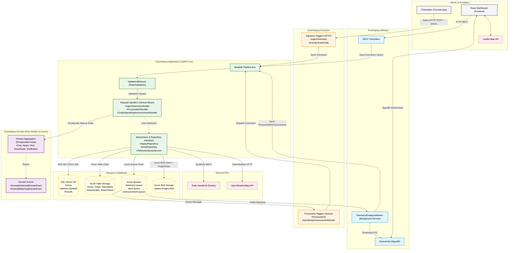

```mermaid
flowchart TB
    %% Styling Classes
    classDef client fill:#f5f5f7,stroke:#1d1d1f,stroke-width:1.5px,color:#000;
    classDef webapi fill:#e1f5fe,stroke:#0288d1,stroke-width:1.5px,color:#000;
    classDef functions fill:#fff3e0,stroke:#f57c00,stroke-width:1.5px,color:#000;
    classDef application fill:#e8f5e9,stroke:#388e3c,stroke-width:2px,color:#000;
    classDef domain fill:#f3e5f5,stroke:#7b1fa2,stroke-width:2px,color:#000;
    classDef infra fill:#eceff1,stroke:#455a64,stroke-width:1.5px,color:#000;
    classDef storage fill:#fffde7,stroke:#fbc02d,stroke-width:1.5px,color:#000;
    classDef external fill:#ffebee,stroke:#c62828,stroke-width:1.5px,stroke-dasharray: 4 4,color:#000;

    %% 1. CLIENTS LAYER
    subgraph Clients ["Clients & Emulators"]
        direction LR
        Sim["ITSimulator (Console App)"]:::client
        Dash["React Dashboard (Frontend)"]:::client
        Leaflet["Leaflet Map API"]:::external
    end

    %% 2. ENTRY POINTS
    subgraph WebApiProj ["SmartApiary.WebApi"]
        direction TB
        Ctrl["REST Controllers"]:::webapi
        Hub["DeviceHub (SignalR)"]:::webapi
        Worker["TelemetryBroadcastWorker (Background Service)"]:::webapi
    end

    subgraph FuncProj ["SmartApiary.Functions"]
        direction TB
        HttpTrig["Ingestion Triggers (HTTP)<br>•IngestTelemetry<br>•ActivateSmartScale"]:::functions
        QueueTrig["Processing Triggers (Queue)<br>•ProcessAlerts<br>•SprinklingAnnouncementMonitor"]:::functions
    end

    %% 3. APPLICATION CORE (CQRS / MediatR)
    subgraph AppCore ["SmartApiary.Application (CQRS Core)"]
        direction TB
        MediatR["MediatR Pipeline Bus"]:::application
        ValBeh["ValidationBehavior (FluentValidation)"]:::application
        Handlers["Request Handlers (Vertical Slices)<br>•IngestTelemetryHandler<br>•ProcessAlertHandler<br>•CreateSprinklingAnnouncementHandler"]:::application
        Interfaces["Abstractions & Repository Interfaces<br>•IApiaryRepository<br>•IHiveRepository<br>•ITelemetryQueueService"]:::application
    end

    %% 4. DOMAIN LAYER
    subgraph DomainCore ["SmartApiary.Domain (Rich Models & Events)"]
        direction TB
        Entities["Domain Aggregates (Encapsulated state)<br>•User, Apiary, Hive, SmartScale, Notification"]:::domain
        Events["Domain Events<br>•AnomalyDetectedDomainEvent<br>•PesticideWarningDomainEvent"]:::domain
    end

    %% 5. STORAGE TIER
    subgraph StorageTier ["Storage & Databases"]
        direction LR
        SQLDB[("SQL Server DB<br>•Users<br>•Apiaries (Spatial)<br>•Parcels")]:::storage
        Tables[("Azure Table Storage<br>•Hives, Crops, Telemetries<br>•SmartScales, ResetTokens")]:::storage
        Queues[("Azure Queues<br>•telemetry-queue<br>•alert-queue<br>•announcement-queue")]:::storage
        Blobs[("Azure Blob Storage<br>•apiary-images-blob")]:::storage
    end

    %% 6. EXTERNAL SERVICES
    subgraph ExtAPIs ["External APIs"]
        direction TB
        SendGrid["Twilio SendGrid (Emails)"]:::external
        OpenWeather["OpenWeatherMap API"]:::external
    end

    %% --- CONNECTIONS & FLOWS ---
    
    %% Ingestion flows
    Sim -->|"Ingest (HTTP POST + token)"| HttpTrig
    HttpTrig -->|"Send Command"| MediatR
    
    %% Web API flows
    Dash -->|"HTTP REST"| Ctrl
    Ctrl -->|"Send Command / Query"| MediatR
    Dash <-->|"SignalR WebSockets"| Hub
    
    %% Map integrations
    Dash <--> Leaflet

    %% MediatR Pipeline & Core Flow
    MediatR --> ValBeh
    ValBeh -->|"Validation Passed"| Handlers
    Handlers -->|"Orchestrate State & Rules"| Entities
    Entities -.->|"Raises"| Events

    %% Queue triggers
    Queues -->|"Queue Message"| QueueTrig
    QueueTrig -->|"Dispatch Command"| MediatR

    %% WebApi Worker polling & broadcasts
    Queues -->|"Read Telemetry"| Worker
    Worker -->|"Broadcast DTO"| Hub
    Worker -->|"Send ProcessTelemetryCommand"| MediatR

    %% Infrastructure & Storage Access
    Handlers -.->|"Uses Interfaces"| Interfaces
    Interfaces -->|"ADO.NET Direct SQL"| SQLDB
    Interfaces -->|"Azure Table Client"| Tables
    Interfaces -->|"Azure Queue Client"| Queues
    Interfaces -->|"Azure Blob Client + ImageSharp"| Blobs
    Interfaces -->|"SendGrid SMTP"| SendGrid
    Interfaces -->|"OpenWeather HTTP"| OpenWeather
```